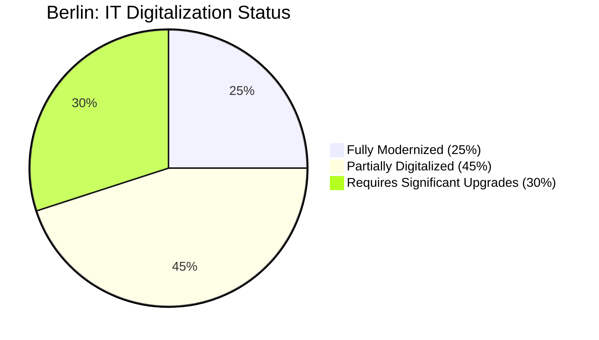
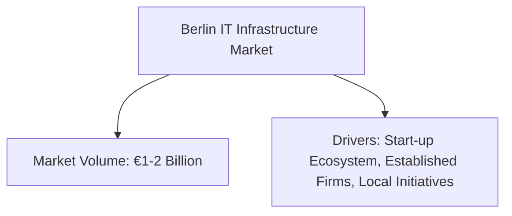

# Berlin Market Diagrams

## 1. Digitalization in Berlin (Pie Chart)

*This pie chart displays the estimated IT digitalization status for Berlin-based companies, with 25% fully modernized, 45% partially digitalized, and 30% requiring major upgrades.*

## 2. Investment Segments in Berlin (Flowchart)
```mermaid
flowchart LR
    A[Investment Segments in Berlin]
    B[Low-Priced (€10k-30k): 40%]
    C[Mid-Priced (€40k-70k): 40%]
    D[High-Priced (€100k+): 20%]
    
    A --> B
    A --> C
    A --> D
```
*This flowchart shows the distribution of investment segments for IT infrastructure projects in Berlin, categorized into low-, mid-, and high-priced solutions.*

## 3. Berlin Market Volume & Drivers (Flowchart)

*This diagram outlines Berlin's overall market volume (estimated at €1–2 billion) and identifies the main drivers such as the vibrant start-up ecosystem and support from local initiatives.*