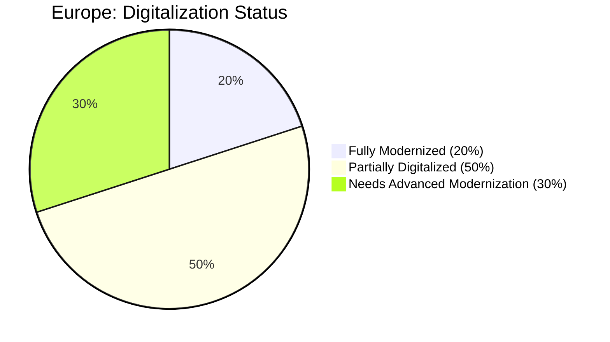
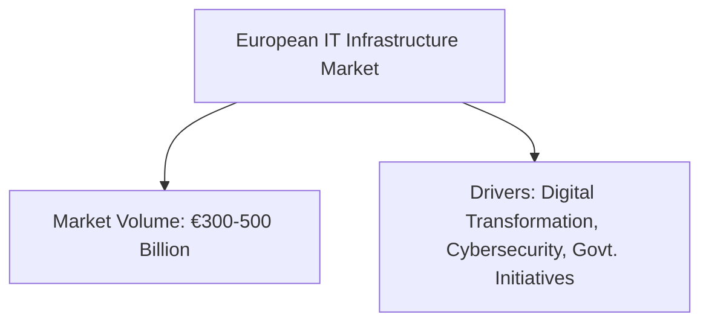

# Europe Market Diagrams

## 1. Digitalization Status (Pie Chart)

*This pie chart illustrates the digitalization status across European companies, with 20% fully modernized, 50% partially digitalized, and 30% needing advanced modernization.*

## 2. Investment Segments (Flowchart)
```mermaid
flowchart LR
    A[European Investment Segments]
    B[Low-Priced (€10k-30k): 35%]
    C[Mid-Priced (€40k-70k): 45%]
    D[High-Priced (€100k+): 20%]
    
    A --> B
    A --> C
    A --> D
```
*This flowchart depicts the breakdown of IT investment segments in Europe, with approximate percentages for low-, mid-, and high-priced solutions.*

## 3. Overall Market Volume & Drivers (Flowchart)

*This diagram presents the European market’s overall volume (estimated at €300–500 billion) and highlights the main growth drivers such as digital transformation initiatives and cybersecurity needs.*
```
