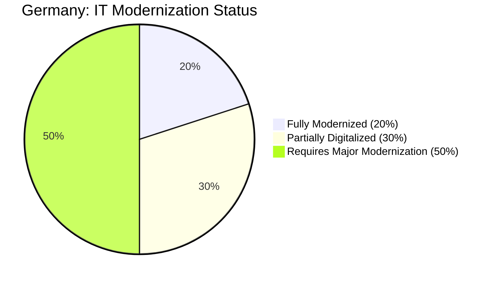
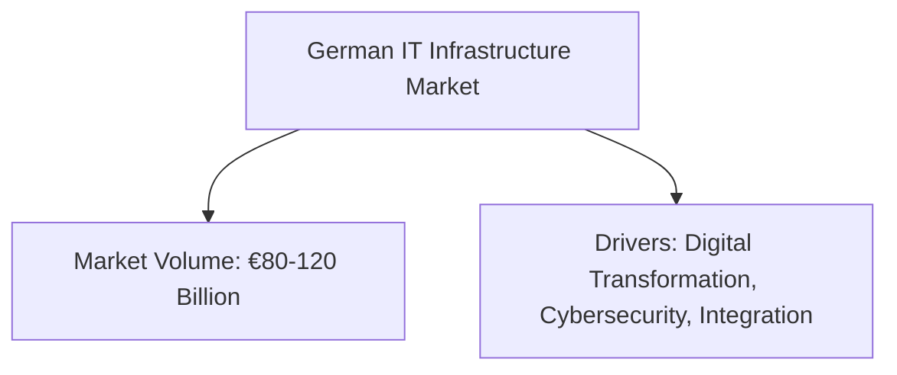

# Germany Market Diagrams

## 1. Digitalization / IT Modernization Need (Pie Chart)

*This diagram shows the estimated distribution of digitalization among German companies: 20% are fully modernized, 30% are partially digitalized, and 50% need major IT upgrades.*

## 2. Investment/Price Segments (Flowchart)
```mermaid
flowchart LR
    A[Investment Segments]
    B[Low-Priced (€10k-30k): 40%]
    C[Mid-Priced (€40k-70k): 40%]
    D[High-Priced (€100k+): 20%]
    
    A --> B
    A --> C
    A --> D
```
*This flowchart represents the distribution of investment segments in Germany, indicating that approximately 40% of projects fall into the low- and mid-priced categories each, with 20% in the high-priced bracket.*

## 3. Overall Market Volume & Drivers (Flowchart)

*This diagram outlines the overall market volume (estimated at €80–120 billion) and the key drivers shaping the demand for IT infrastructure solutions in Germany.*
