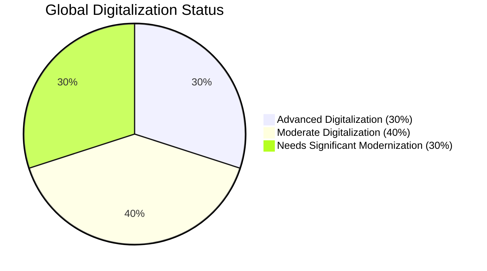
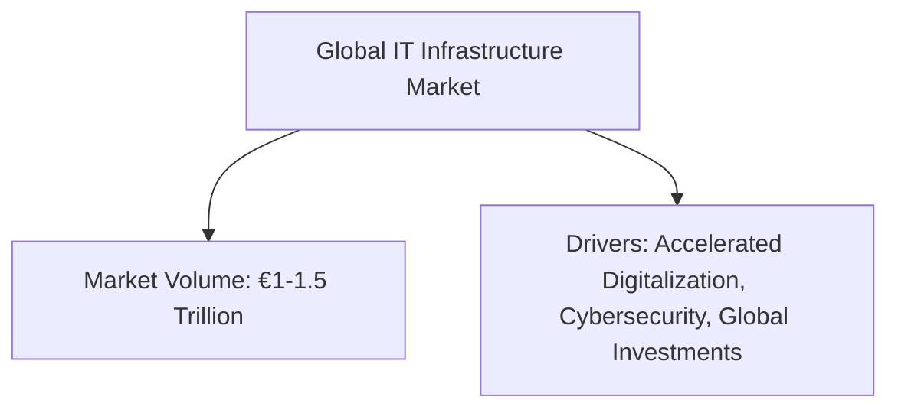

# Global Market Diagrams

## 1. Global Digitalization Status (Pie Chart)

*This pie chart shows an estimated global digitalization distribution: 30% of companies are advanced, 40% have moderate digitalization, and 30% require significant modernization.*

## 2. Global Investment Segments (Flowchart)
```mermaid
flowchart LR
    A[Global Investment Segments]
    B[Low-Priced (€10k-30k): 40%]
    C[Mid-Priced (€40k-70k): 40%]
    D[High-Priced (€100k+): 20%]
    
    A --> B
    A --> C
    A --> D
```
*This flowchart illustrates the distribution of investment segments globally, indicating that roughly 40% of IT projects fall into both low and mid-price categories, with 20% in the high-price category.*

## 3. Overall Global Market Volume & Drivers (Flowchart)

*This diagram outlines the global market volume (estimated between €1–1.5 trillion) and the key factors fueling growth, such as digital transformation and cybersecurity initiatives.*
